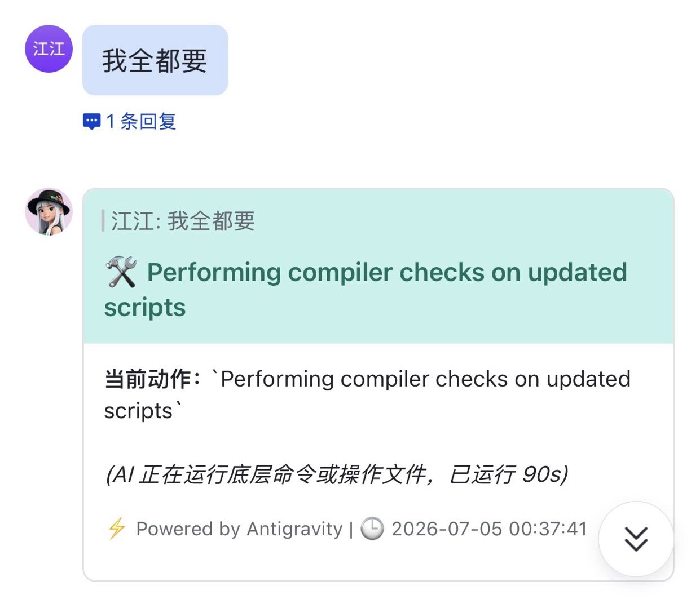

# Antigravity Feishu Bot

基于飞书原生 WebSocket 与本地 `antigravity`（`agy`）引擎的智能助手：在飞书里远程驱动本机做代码读写、终端执行、多模态解析与项目管理。

---

## 📸 界面预览

| 首次部署欢迎与快捷引导 | 交互式工作区项目管理器 | 实时动作与工具耗时指示 |
| :---: | :---: | :---: |
|  |  |  |

| 视频多模态深度解析 | 生成物自动捕获与回传 | 系统 OTA 自我热升级 |
| :---: | :---: | :---: |
|  |  |  |

---

## 🌟 核心功能

### 交互体验
- 飞书 Interactive Card 状态流转（资源加载 / 工具执行 / 思考中 / 最终回复）
- 卡片原生按钮：切模型、选项目、确认升级、笔记与偏好管理
- 按 `chat_id` 异步排队，忙时入队而不是直接拒绝

### 本地执行引擎
- 读写宿主机文件、执行 Shell（由本机 `agy` 驱动）
- 工作区绑定：`/project` 设定活跃目录
- 生成物自动回传（图片 / 附件，路径白名单校验）

### 多模态
- 支持图片、Word / PDF / 文本、音视频等下行解析
- 上行自动捕获 transcript 中的本地产物并回传到飞书

### 运维
- `install.sh` 一键安装 / 升级 / 卸载（PM2）
- `/update` OTA 热升级
- SQLite 持久化会话与用户偏好
- Docker / Compose 可选部署

---

## ⌨️ Slash 指令（与代码一致）

| 指令 | 说明 |
|------|------|
| `/help` | 交互式帮助与快捷按钮 |
| `/auth` | 未授权会话向管理员申请使用权限 |
| `/user` | 管理员管理用户/群（面板 + grant/revoke/ban/promote 等子命令） |
| `/model` | 弹出模型切换面板 |
| `/project` | 项目管理器（切换 / 新建 / 设置根目录） |
| `/note` | 记事本（`/note add`、`/note del`、`/notes`） |
| `/memory` | 个人偏好记忆管理（卡片内新增 / 删除） |
| `/brain` | Antigravity 全局跨会话记忆看板 |
| `/context` | 上下文 Token 容量看板 |
| `/quota` | Google AI Pro 额度查询 |
| `/status` | 进程 CPU / 内存 / Uptime / 日志摘要 |
| `/clear` | 清空当前会话上下文 |
| `/stop` | 强制中断当前任务并清空排队 |
| `/update` | 检查更新；`/update confirm` 执行热升级 |

> 已移除：`/role`、`/remember`、`/forget`（偏好统一走 `/memory` 卡片交互）。

## 🔐 权限机制

- 首次部署后，**第一个私聊会话自动绑定为最高管理员**；群聊无法被绑定。
- 其他会话默认**静默**：发送 `/auth` 申请权限，管理员收到授权卡片（显示会话名称/群名、会话 ID、申请者），可一键按"基础 / 开发 / 完全"三档授权或拒绝/拉黑。
- 管理员可用 `/user` 查看并管理全部会话（授权、撤销、拉黑、提升管理员等）。
- 权限联动：`--dangerously-skip-permissions` 仅对管理员生效；普通用户强制受限模式，且仅拥有对应能力时才可使用项目切换、额度查询等功能。
- 限流：普通用户每分钟最多 5 条消息、每日最多 100 次执行（管理员不限）。

---

## 🚀 安装部署

### 系统要求
- Python 3.10+
- Node.js / npm（仅用于安装 PM2：`npm install -g pm2`）
- 本机已安装并可用的 Antigravity CLI（`agy` 或 `antigravity`）

### 1) 一键脚本（推荐）

```bash
bash <(curl -sL https://raw.githubusercontent.com/Level6me/antigravity-feishu-bot/main/install.sh)
```

按提示填入 `FEISHU_APP_ID` / `FEISHU_APP_SECRET` 即可。

本地已 clone 时：

```bash
chmod +x install.sh
./install.sh
# 升级: ./install.sh update
# 卸载: ./install.sh uninstall
```

### 2) 手动部署

```bash
python3 -m venv venv
source venv/bin/activate
pip install -r requirements.txt
cp .env.example .env
# 编辑 .env 填入凭证与可选路径配置

pm2 start venv/bin/python3 --name "feishu-bot" -- main.py
# 可选：保持 agy 热进程
pm2 start venv/bin/python3 --name "agy-daemon" -- agy_daemon.py
pm2 save
```

飞书应用需开启 **WebSocket 长连接**，并开通消息相关权限（如 `im:message`）。

### 3) Docker Compose

```bash
cp .env.example .env
# 填入 FEISHU_APP_ID / FEISHU_APP_SECRET
# 如需挂载宿主机 agy 数据与工作区，可设置 HOST_ANTIGRAVITY_HOME / HOST_WORKSPACE

docker compose up -d --build
# 可选 agy 守护进程：
docker compose --profile daemon up -d
```

> Docker 镜像只包含 Bot 运行时。`agy` 二进制与登录态需安装在宿主机并通过 volume 挂载，或在容器内自行安装。

---

## ⚙️ 环境变量

详见 [`.env.example`](.env.example)。常用项：

| 变量 | 说明 |
|------|------|
| `FEISHU_APP_ID` / `FEISHU_APP_SECRET` | 飞书应用凭证 |
| `ALLOWED_USERS` / `ALLOWED_CHATS` | 可选白名单（open_id / chat_id，逗号分隔） |
| `ANTIGRAVITY_BIN` | `agy` 绝对路径；空则自动探测 |
| `ANTIGRAVITY_HOME` | antigravity-cli 数据根目录，默认 `~/.gemini/antigravity-cli` |
| `WORKSPACE_ROOT` | 项目管理器默认根目录，默认 `~` |
| `DANGEROUSLY_SKIP_PERMISSIONS` | 是否向 agy 传跳过权限确认（默认 true，风险高） |

---

## 🏗 架构

```
飞书客户端
    │  WebSocket (lark_oapi.ws)
    ▼
main.py                 进程入口 / 优雅退出
    │
    ├─ handlers/        事件与消息管线
    │   ├─ events.py        IM 收消息
    │   ├─ card_actions.py  卡片按钮回调
    │   ├─ messages.py      指令路由 / 媒体防抖入队
    │   ├─ pipeline.py      单会话队列与任务执行
    │   └─ media.py         图 / 文件 / 音视频下载
    ├─ cards/           交互卡片构建（按场景拆分）
    ├─ commands.py      Slash 指令实现
    ├─ executor.py      拉起 agy 子进程、读 transcript
    ├─ multimodal.py    生成物回传
    ├─ lark_client.py   飞书 API 封装
    ├─ database.py      SQLite 会话 / 偏好
    ├─ config.py        配置与路径解析（可移植）
    └─ agy_daemon.py    可选 agy 保活守护进程
```

路径不再写死：`transcript` / OAuth / global memory 均通过 `config.get_*` 解析，可用 `ANTIGRAVITY_HOME` 覆盖。

---

## 🔒 安全提示

本 Bot 运行在宿主机上，具备近 shell 级能力。上线前建议：

1. 配置 `ALLOWED_USERS` / `ALLOWED_CHATS` 白名单  
2. 评估是否关闭 `DANGEROUSLY_SKIP_PERMISSIONS`  
3. 仅在可信网络 / 私聊中使用，勿对公开群无限制开放  

---

## 🛠 运维常用命令

```bash
pm2 logs feishu-bot
pm2 restart feishu-bot
pm2 stop feishu-bot
pm2 logs agy-daemon
```

---

## 📁 仓库结构（精简）

```
main.py              # 入口
app_state.py         # 进程内共享状态
handlers/            # 事件 / 消息 / 队列
cards/               # 卡片 UI 模块
card_builder.py      # 兼容旧 import: from card_builder import CardBuilder
commands.py
executor.py
config.py
database.py
agy_daemon.py
Dockerfile
docker-compose.yml
install.sh
requirements.txt
.env.example
```
