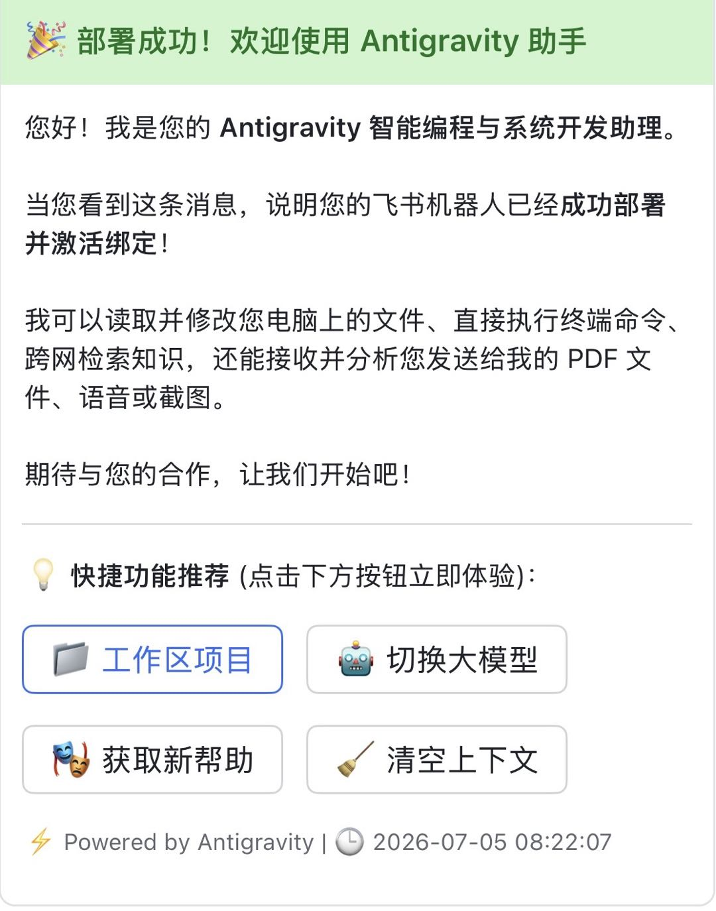
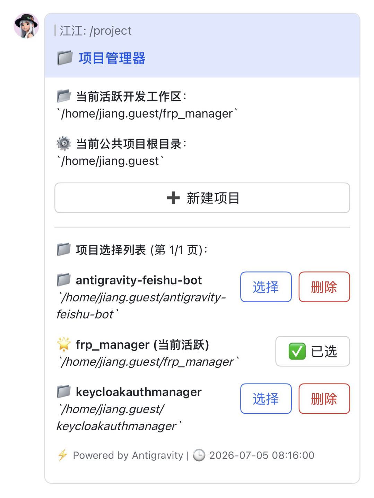
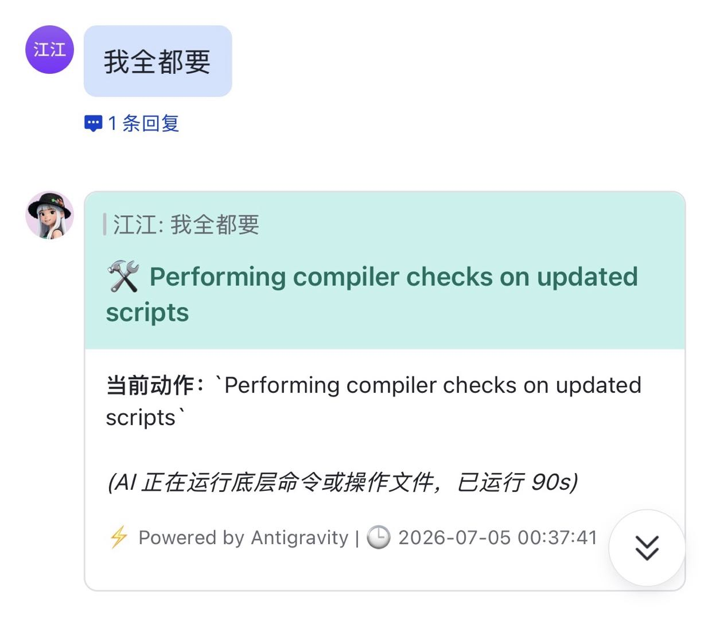
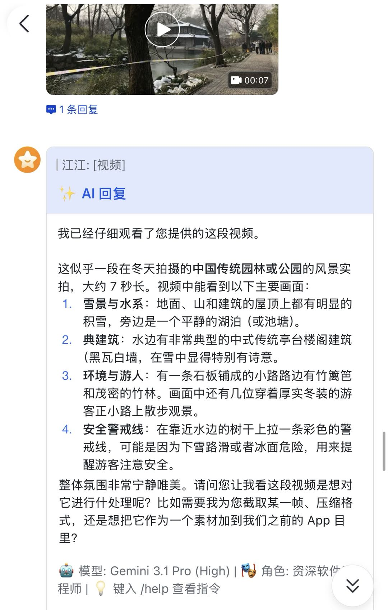
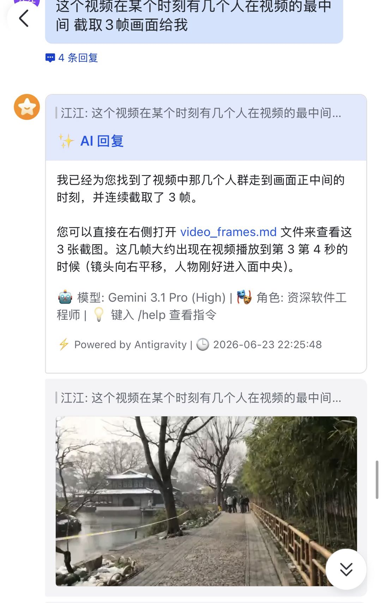
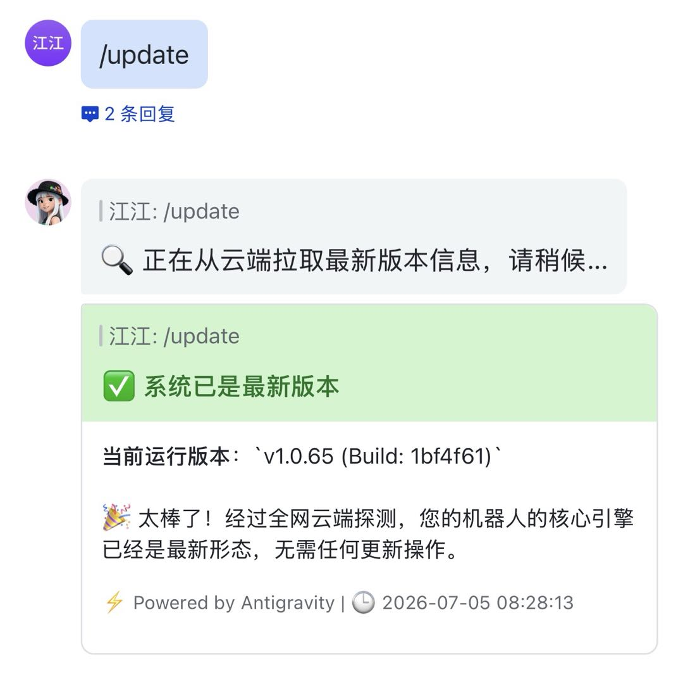

# 🚀 Antigravity Feishu Bot

<div align="center">


-purple?style=flat-square)


</div>

基于飞书原生 WebSocket 长连接与宿主机 `antigravity`（`agy`）核心引擎，深度融合 **System One 混合全链路决策网关（决策模型 + HMDM）**与**动态热插拔插件生态**的企业级全能智能研发与运维助手。

无需公网 IP 或 Webhook 回调配置，在飞书内即可直接远程驱动服务器完成全栈代码读写、智能终端命令执行、多模态音视频深度解析、Home Assistant 智能家居控制、长程分层记忆与任务自动化规划。

---

## 🌟 核心特性与技术亮点

### 🧠 1. System One 混合决策网关与自适应推理
- **灵活接入决策大模型**：
  - 可通过 `.env` 或飞书端 `/s1` 控制台热配置不同平台的决策大模型与接口地址（支持如 **阿里云百炼 `decision-model-preview`**、**TypeSafe `jev-latest`** 及其他兼容协议的模型与自定义网关端点）。
- **L1 / L2 / L3 三级全链路安全模式（可在 `/s1` 面板实时切换）**：
  - **L1 · 入口决策 (`gateway`)**：毫秒级识别用户意图、拦截越权与 Prompt 注入请求，并分流高频插件直通。
  - **L2 · 双向决策 (`sentry`)**：在 L1 基础上增加**模型输出端安全守卫**，在文字与语音发出前自动识别并对 Token、密码、私钥等敏感凭证进行原位脱敏保护。
  - **L3 · 全流程决策 (`copilot`)**：覆盖输入、工具执行、报错诊断与输出全链路；高危终端操作自动弹出**交互式审批卡片**（支持单次/本轮放行），报错时自动执行根因诊断并注入 `Memory Guard` 死胡同防重记录。
- **HMDM 四层混合数学决策引擎（< 0.5ms 本地推理）**：
  - 融合 8 维句法/语义特征抽取、Markov 会话状态转移、贝叶斯后验融合与 EWMA 风险衰减模型，对闲聊走零延迟 Fast-Path 放行；对复杂工程任务自动注入 `scope` 边界契约与步数/时间预算控制。
- **动态 N 档自适应思考路由（`LOW` / `MEDIUM` / `HIGH` / `XHIGH`）**：
  - 按模型族动态聚类全部可用档位（兼容 1/2/3/4 及未来 N 档模型，如 `Gemini 4 Hydrogen` 的 `Low → Medium → High → XHigh`），按任务复杂度与连续排障次数自动升降档，并强制对齐底层 CLI `--effort` 与预热进程池升级。
- **高频意图极速 Fast-Path（< 200ms 秒回）**：
  - 针对服务器健康监控（`server_health`）、随身备忘（`notes`）、计划调度（`cron`）、智能家居（`smart_home`）与网关配置查询等高频意图，直接命中 Fast-Path 本地秒级回传交互卡片，零大模型冷启动延迟与 Token 消耗。
- **无感静默降级（Zero-Overhead Fallback）**：未配置 Key 或远程网关超时/不可达时，自动无缝切换为纯本地 HMDM 数学引擎与正则启发式规则，全程不中断主任务链路。

---

### 🧩 2. 动态插件总线与热插拔生态 (Plugin Architecture)
- **动态热加载与热重载**：插件支持独立运行、热重载与生命周期管理，无需重启机器人主进程。
- **多阶段生命周期 Hook**：提供 `before_ai`、`after_ai`、`on_command`、`on_card_action` 深度生命周期钩子。
- **开箱即用核心插件库**：
  - 🏠 **Home Assistant**：NLP 语义直达控制智能家居设备与场景联动，毫秒级状态同步与卡片回显。
  - ⏰ **Cron Scheduler**：支持自然语言或标准 Cron 表达式设置定时提醒与周期自动化任务（含历史执行审计日志视图）。
  - 📝 **Notes Manager**：随身交互式便签与备忘录管理面板。
  - 🧠 **AI Memory**：跨会话沉淀用户个性化习惯、工程偏好与安全红线。
  - 📟 **Passport Bridge**：协同硬件网关与音色调度控制。
  - 📊 **Server Health & Multi-Agent**：主机系统健康巡检直出卡片与多智能体协同任务调度支持。
  - 🔌 **Raspberry Pi GPIO API Status**：树莓派引脚交互控制与 LED 呼吸灯/蜂鸣器思考状态同步指示。
  - 🔄 **System Updater**：全自动平滑无损 OTA 在线自升级（支持 GitHub 与 Gitee 双源）。
- **交互式插件中心 (`/plugins`)**：飞书端可视化卡片，支持一键启停插件、查看运行状态与版本配置。

---

### 🖥️ 3. 本地全栈开发与执行底座
- **宿主机直驱**：依托本机 `agy` 引擎，支持在宿主机目录读写源码、安装依赖、调试构建与执行 Shell 脚本。
- **项目工作区隔离 (`/project`)**：呼出可视化项目管理器，支持多目录快速切换、新建工程空间、或直接输入 Git 仓库地址自动 Clone 并在飞书里即刻开发。
- **生成物智能捕获回传**：自动嗅探模型在执行过程中生成的图片、数据图表、Word、Excel、PDF 及压缩包，自动通过飞书富媒体通道原生回传。
- **任务规划流转（Task Planning Directive）**：对重型工程任务自动解析结构化步骤并在飞书卡片中实时打勾推进。

---

### 💬 4. 原生卡片流转、长程记忆与高可用会话池
- **极致秒级响应与弹性进度展示**：消息送达后秒级下发交互卡片；任务运行期间采用 **10 格方块进度条**（`■■■■■□□□□□`）与 **2~8 弹性宏观步骤**，结合阶段自适应刷新呈现双层执行轨迹与实时耗时。
- **长程分层记忆与断点接力（Session Relay）**：内置上下文压缩守卫（Compaction Guard）、预算看门狗与长任务自动接力机制，防止超长任务截断丢失状态。
- **会话独立排队与高可用预热池**：按 `chat_id` 维护独立异步队列并支持 `/stop` 紧急熔断；常驻预热池支持随自适应思考档位自动升级会话、40 分钟 TTL 定时回收、Stream 异常自动重连与顶层异常飞书实时提示。

---

### 🎙️ 5. 多模态与语音双向交互
- **全格式下行多模态**：支持直接向机器人发送图片、PDF、Word 文档、代码文件、短视频或音频条，自动抽取并提供上下文分析。
- **原生双向语音**：用户发送飞书语音条时，系统自动识别转写、执行推理，并使用 Edge-TTS 实时回传生动自然的口语化语音答复。

---

## 📸 界面预览

| 首次部署欢迎与快捷引导 | 交互式工作区项目管理器 | 实时动作与工具耗时指示 |
| :---: | :---: | :---: |
|  |  |  |

| 视频多模态深度解析 | 生成物自动捕获与回传 | 系统 OTA 自我热升级 |
| :---: | :---: | :---: |
|  |  |  |

---

## ⌨️ 完整控制台指令清单 (Slash Commands)

> [!NOTE]
> 指令分类与功能与飞书端实际 `/help` 控制大厅及核心代码实现严格同步。

### 🎛️ 1. 模型与记忆控制
| 指令 | 别名 | 权限级别 | 功能与交互说明 |
| :--- | :--- | :---: | :--- |
| `/model` | `/card` / `/menu` | 全部用户 | 弹出大模型选择面板，按模型族动态热切换（Gemini 4 Hydrogen/Argon、Gemini 3.8 Flash、Claude 5.5 等） |
| `/context` | - | 全部用户 | 查看对话上下文 Token 占用统计与容量看板 |
| `/memory` | `/pref` | 全部用户 | 查看与管理用户的个人偏好设定（支持交互式新增与删除） |
| `/brain` | - | 全部用户 | 查看 Antigravity 全局跨会话记忆库与偏好知识透视 |
| `/clear` | - | 全部用户 | 彻底清空当前会话的上下文记忆与预热进程池，开启全新对话 |

### 📁 2. 项目与工程管理
| 指令 | 别名 | 权限级别 | 功能与交互说明 |
| :--- | :--- | :---: | :--- |
| `/project` | - | 全部用户 | 弹出项目管理器（支持切换工作区、新建项目、设置公共根目录与翻页） |
| `/note` | `/notes` | 全部用户 | 随身记事本看板（支持 `/note add` 新增、`/note del` 删除、查看详情与清空） |
| `/quota` | - | 授权用户 | 查询 Google AI Pro 套餐官方剩余额度看板 |
| `/status` | - | 管理员 | 查看 Bot 进程 Uptime、CPU/内存指标、重启计数与近期错误日志摘要 |

### ⚡ 3. 系统管理与安全控制
| 指令 | 别名 | 权限级别 | 功能与交互说明 |
| :--- | :--- | :---: | :--- |
| `/help` | - | 全部用户 | 呼出交互式帮助卡片与全功能快捷控制大厅 |
| `/stop` | - | 全部用户 | 紧急叫停当前会话中正在执行的后台任务并清空排队任务 |
| `/s1` | `/sys1` / `/system1` | 全部用户 | **打开 System One 决策网关控制台**（L1/L2/L3 等级切换、自适应思考开关、百炼 `decision-model-preview` / `jev-latest` / 自定义模型及 Base URL 热配置、连通性测试） |
| `/update` | - | 管理员 | 检查云端最新版本（支持 `/update confirm` 触发 OTA 无损平滑热升级，内置 Gitee 备用源） |
| `/ping` | - | 全部用户 | 探测核心服务与网络健康存活状态 |
| `/auth` | - | 全部用户 | 向系统管理员发送授权申请卡片（若已授权则提示正常） |
| `/user` | - | 管理员 | 用户与群聊权限管理控制台（`/user grant/revoke/ban/promote/demote/reset-admin`） |

### 🧩 4. 插件与硬件扩展指令
| 指令 | 别名 | 权限级别 | 功能与交互说明 |
| :--- | :--- | :---: | :--- |
| `/plugins` | `/plugin` | 管理员 | 打开插件生态管理器（查看已挂载插件、切换启用状态、执行 `/plugin reload` 热重载） |
| `/cron` | `/schedule` | 全部用户 | 定时提醒与 Cron 任务计划面板（支持自然语言或表达式设置倒计时与周期闹钟） |
| `/passport` | `/hardware` / `/aipass` | 全部用户 | FoloToy / AI Passport 硬件协同控制与音色管理面板 |
| `/stat` | `/led` / `/light` | 全部用户 | 树莓派综合硬件指标、引脚电平与指示灯/蜂鸣器看板 |

---

## 🏗️ 核心系统架构

```mermaid
flowchart TD
    User["飞书客户端 (用户 / 群聊 / 语音条)"] -->|WebSocket Lark OAPI| Main["main.py (事件分发器)"]
    Main --> Pre["handlers/messages.py (消息防抖与指令路由)"]
    
    Pre -->|Slash 命令 (/project /s1 /plugins 等)| Cmd["commands.py (交互式卡片渲染)"]
    
    Pre -->|自然语言请求| Gate{"System One 决策网关\n(决策大模型 + HMDM L1/L2/L3)"}
    
    Gate -->|高频意图直达| FastPath{"Fast-Path 极速插件总线\n(< 200ms)"}
    FastPath -->|系统健康| HealthPlug["server_health 插件"]
    FastPath -->|随身便签| NotePlug["notes_manager 插件"]
    FastPath -->|定时计划| CronPlug["cron_scheduler 插件"]
    FastPath -->|智能家居| HAPlug["home_assistant 插件"]
    HealthPlug & NotePlug & CronPlug & HAPlug --> CardUI["飞书原生交互式卡片"]

    Gate -->|拦截安全隐患| RejectCard["安全风控拦截告警卡片"] --> CardUI
    
    Gate -->|复杂工程任务| AgentQueue["会话异步排队队列 (chat_id)"]
    AgentQueue --> Adapter["N 档动态路由 & Scope 契约\n(Low ~ XHigh / SessionPool)"]
    Adapter --> Executor["executor.py (Antigravity CLI 引擎)"]
    
    Executor -->|L3 工具风险审批 / 报错自愈| CoPilot["Co-Pilot 运行期审计与 Memory Guard"]
    CoPilot -->|审批卡片 / 自愈续跑| CardUI
    Executor -->|L2 出口凭据脱敏| OutputGuard["Sentry 输出安全守卫"] --> CardUI
    Executor -->|10 格弹性进度 & Task Plan| CardUI
    Executor -->|执行 Shell / 读写代码| HostFS["宿主机操作系统 & 工作区"]
    Executor -->|产出图像/文件回传| MultiModal["handlers/media.py (飞书富媒体通道)"]
    MultiModal --> CardUI
    CardUI --> User
```

---

## 🔐 权限与安全风控机制

1. **第一私聊自动提权（Auto-Admin）**：
   - 首次部署启动后，**首个向 Bot 发送私聊消息的用户将自动绑定为系统最高管理员**（群聊不可被自动绑定）。
2. **三档细粒度授权体系**：
   - 未授权会话默认保持静默，发送 `/auth` 后，管理员会收到包含申请者信息的审批卡片，支持一键审批：
     - **基础版（Basic）**：日常文本问答、记事本、简单查询。
     - **开发版（Dev）**：可使用项目切换、代码查看与受限工具。
     - **完全版（Full）**：具备终端 Shell 执行与宿主机全权限。
3. **S1 三级全链路安全防护网（L1 / L2 / L3）**：
   - **L1 入口决策 (`gateway`)**：语义与 HMDM 数学引擎联合扫描注入与越权意图，结合工作区边界契约阻断未授权越界访问；
   - **L2 双向决策 (`sentry`)**：在回复与语音下发前执行敏感凭证扫描与原位脱敏，防止 API Token、私钥或密码意外泄露；
   - **L3 全流程决策 (`copilot`)**：在工具执行期实时审计高危 Shell 操作并弹出飞书交互审批卡片（支持单次放行或本轮授权，自动接入续跑），对 `rm -rf /`、磁盘覆写等毁灭性指令物理级阻断；`--dangerously-skip-permissions` 仅对受信任的最高管理员生效。
4. **防刷限流（Rate Limiting）**：
   - 普通授权用户每分钟最多发送 5 条消息，每日上限 100 次工具执行（管理员不限）。

---

## 🚀 安装部署指南

### 环境要求
- **Linux** (Ubuntu 20.04+ / Debian 11+ / CentOS / Arch 等) 或 macOS
- **Python 3.10+**
- **Node.js & PM2**（用于生产环境高可用守护：`npm install -g pm2`）
- 本机已安装并完成登录认证的 **Antigravity CLI**（`agy` 或 `antigravity`）

---

### 方法 1：一键交互式脚本安装（推荐）

在服务器终端直接执行：

```bash
bash <(curl -sL https://raw.githubusercontent.com/Level6me/antigravity-feishu-bot/main/install.sh)
```

脚本将自动引导您输入飞书 `FEISHU_APP_ID` 和 `FEISHU_APP_SECRET`，并自动构建虚拟环境、安装依赖与启动 PM2 守护进程。

**本地已 Clone 代码时的一键运维：**
```bash
chmod +x install.sh
./install.sh           # 安装与初始化
./install.sh update    # 极速拉取并平滑重启
./install.sh uninstall # 彻底清理后台服务与环境
```

---

### 方法 2：手动源码部署

```bash
# 1. 克隆代码仓库
git clone https://github.com/Level6me/antigravity-feishu-bot.git
cd antigravity-feishu-bot

# 2. 创建并激活 Python 虚拟环境
python3 -m venv venv
source venv/bin/activate

# 3. 安装依赖包
pip install -r requirements.txt

# 4. 配置环境变量
cp .env.example .env
nano .env  # 填入飞书凭证，按需配置 TYPESAFE_API_KEY

# 5. 使用 PM2 启动服务（推荐）
pm2 start venv/bin/python3 --name "feishu-bot" -- main.py
pm2 save
pm2 startup
```

---

### 方法 3：Docker / Docker Compose 部署

```bash
cp .env.example .env
# 编辑 .env 配置飞书凭据与挂载目录

docker compose up -d --build
```

---

## ⚙️ 完整环境变量配置指南

编辑项目根目录下的 `.env` 文件：

```env
# ==========================================
# 1. 飞书开放平台配置 (必填)
# ==========================================
FEISHU_APP_ID=cli_xxxxxxxxxxxx
FEISHU_APP_SECRET=xxxxxxxxxxxxxxxxxxxxxxxxxxxxxxxx

# ==========================================
# 2. 安全与白名单配置 (可选)
# ==========================================
# 允许访问的 open_id 或 chat_id，多个用英文逗号分隔；留空则由 /auth 授权机制管理
ALLOWED_USERS=
ALLOWED_CHATS=
# 是否向 agy 传递跳过权限确认标记 (默认 true，仅对管理员生效)
DANGEROUSLY_SKIP_PERMISSIONS=true

# ==========================================
# 3. Antigravity 引擎与工作区配置
# ==========================================
# agy 可执行文件绝对路径；留空则系统自动探测
ANTIGRAVITY_BIN=
# antigravity-cli 数据存储目录 (默认: ~/.gemini/antigravity-cli)
ANTIGRAVITY_HOME=
# 默认公共工作区根目录 (默认: ~)
WORKSPACE_ROOT=/home/ubuntu
# 默认大模型 (如: gemini-4-hydrogen-high / gemini-3.8-flash-high / claude-sonnet-5-5-high)
DEFAULT_MODEL=gemini-4-hydrogen-high

# ==========================================
# 4. System One 决策网关配置
# ==========================================
# 决策网关 API 密钥 (留空则自动无缝降级为纯本地 HMDM 数学规则引擎)
TYPESAFE_API_KEY=
# 是否启用决策网关
TYPESAFE_ENABLED=true
# 决策安全级别: gateway (L1入口决策) | sentry (L2双向决策) | copilot (L3全流程决策)
TYPESAFE_TIER=gateway
# 是否开启自适应思考深度自动调度 (Low / Medium / High / XHigh)
TYPESAFE_AUTO_MODE=true
# 默认使用的决策模型 (如阿里云百炼 decision-model-preview、jev-latest 或其他自定义模型)
TYPESAFE_MODEL=jev-latest
# 决策网关 Base URL (支持阿里云百炼、TypeSafe 或自建兼容端点)
TYPESAFE_BASE_URL=https://api.typesafe.ai

# ==========================================
# 5. 语音交互与 TTS 设置
# ==========================================
# 是否启用双向语音答复
ENABLE_VOICE_REPLY=true
# Edge-TTS 音色 (推荐: zh-CN-XiaoxiaoNeural / zh-CN-YunxiNeural)
TTS_VOICE=zh-CN-XiaoxiaoNeural

# ==========================================
# 6. OTA 升级网络镜像源 (可选)
# ==========================================
GITEE_MIRROR_URL=
```

---

## 📋 飞书开放平台后台配置（极简 4 步）

1. **开启 WebSocket 长连接模式**：
   - 登录 [飞书开放平台](https://open.feishu.cn/)，进入创建的企业自建应用。
   - 打开 **开发配置 → 事件与回调**（或“事件订阅”），将接收方式切换为 **WebSocket 长连接**（无需公网 IP 和 Webhook 回调 URL）。
2. **开通必要权限（权限管理）**：
   - `im:message`（获取与发送单聊、群组消息）
   - `im:message:resource`（获取消息中的图片、富文本与音视频资源）
   - `im:image`（上传图片）
   - `im:file`（上传本地文件与生成物）
   - `im:message.reaction`（消息表情回复状态标记）
   - `im:chat:readonly`（读取群聊名称）
   - `contact:user.base:readonly`（读取用户飞书昵称）
3. **订阅核心事件**：
   - 添加事件：`im.message.receive_v1`（接收消息事件）
   - 卡片动作回调：`card.action.trigger`（自动支持，无需额外权限）
4. **发布应用版本**：
   - 确认并在 **版本管理与发布** 中创建新版本并发布，确保飞书账号位于应用的**可用范围**内。

---

## 🛠️ 常用运维排错命令

```bash
# 查看主程序实时运行日志
pm2 logs feishu-bot

# 检查进程状态与内存占用
pm2 status

# 重启飞书机器人服务
pm2 restart feishu-bot

# 停止服务
pm2 stop feishu-bot
```

---

## 📄 开源许可证

本项目基于 [MIT License](LICENSE) 协议开源。欢迎提交 Issue 与 Pull Request！
